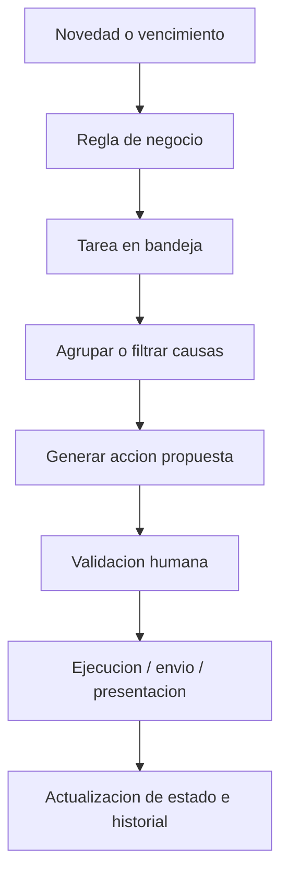

# Requerimientos Funcionales - Vista Abogado y Gestion Diaria

## 1. Contexto

Este documento consolida los requerimientos levantados a partir de las transcripciones `Abogado1.txt`, `Abogado2.txt`, `Abogado3.txt` y la version complementaria `Abogado1(1).txt`, asociadas al diseno de una funcionalidad para una plataforma de gestion legal.

El foco principal es construir una vista operativa para abogados/procuradores que concentre la gestion diaria de causas, novedades judiciales, tareas pendientes, acciones masivas, control de SLA y validacion de escritos o actuaciones propuestas por el sistema.

Nota de insumo: la primera version de `Abogado1.txt` no contenia contenido transcrito util, pero la version complementaria `Abogado1(1).txt` si contiene antecedentes relevantes y fue incorporada al levantamiento.

## 2. Objetivo General

Construir una bandeja diaria de gestion legal que permita al abogado/procurador visualizar, priorizar, agrupar y ejecutar acciones sobre su cartera de causas de forma masiva, automatizada y controlada, reduciendo la gestion caso a caso y asegurando que las novedades relevantes se transformen en tareas accionables.

El objetivo operativo diario de la vista es que el usuario pueda dejar su bandeja de gestion en cero o lo mas despejada posible, actuando sobre todas las causas que requieren gestion propia.

## 3. Principios de Producto

- La plataforma debe estar orientada a la accion, no solo a la consulta.
- La gestion debe ser masiva por defecto, permitiendo tambien gestion individual cuando sea necesario.
- Las novedades del tribunal deben transformarse automaticamente en tareas y acciones sugeridas.
- Toda automatizacion debe operar como propuesta sujeta a revision, validacion o correccion humana.
- El sistema debe permitir crecer en volumen de causas sin crecer proporcionalmente en dotacion.
- La interfaz debe ser simple, generica y comercializable a otros estudios o equipos legales.
- La vista debe evitar multiples pantallas innecesarias; el usuario debe encontrar en un unico panel la mayor parte de lo que necesita para actuar.

## 4. Usuarios y Roles

### 4.1 Abogado / Procurador

Usuario principal de la vista diaria. Gestiona causas, revisa novedades, valida acciones propuestas, genera escritos, coordina actuaciones y mantiene limpia su bandeja.

### 4.2 Jefatura Legal

Supervisa desviaciones, revisa atrasos, controla SLA, formula consultas sobre causas especificas y monitorea el cumplimiento de la gestion diaria.

### 4.3 Equipo de Apoyo / Administrativo

Puede intervenir en tareas operativas especificas, como preparacion de antecedentes, coordinacion con receptores, carga documental o apoyo en presentaciones.

### 4.4 Receptor Judicial

Actor externo que recibe instrucciones asociadas a actuaciones como notificaciones, retiros, exhortos u otras diligencias. La plataforma debe poder generar instrucciones estructuradas para su envio.

## 5. Alcance Funcional

La funcionalidad debe cubrir:

- Panel unico de cartera asignada.
- Semaforo de estado/SLA de causas.
- Bandeja de novedades y tareas pendientes.
- Agrupacion de causas por accion sugerida.
- Filtros para gestion masiva.
- Generacion automatica de escritos.
- Validacion humana de propuestas.
- Registro de historial y observaciones.
- Gestion de consultas internas desde jefatura.
- Coordinacion con receptores.
- Control de vencimientos criticos.
- Desasignacion temporal de causas sin gestion posible.
- Indicadores operativos y comparativos de gestion.
- Validaciones de consistencia previas a cargas o presentaciones masivas.
- Definicion UX orientada a workflow, sin replicar necesariamente la experiencia del Poder Judicial.

## 6. Vista Principal: Panel de Gestion Diaria

### 6.1 Descripcion

La vista principal debe funcionar como el escritorio diario del abogado/procurador. En ella el usuario debe ver su cartera total, el estado general de cumplimiento y una bandeja de tareas accionables.

La vista debe permitir responder preguntas como:

- Que causas requieren gestion hoy.
- Que causas estan fuera de estandar.
- Que causas estan proximas a caer fuera de estandar.
- Que novedades judiciales ingresaron.
- Que accion corresponde ejecutar.
- Que tareas pueden gestionarse masivamente.
- Que causas requieren revision individual.
- Que causas no pueden gestionarse por razones externas.

### 6.2 Componentes Principales

- Resumen de cartera total.
- Semaforo de cumplimiento.
- Bandeja de workflow/tareas.
- Filtros de agrupacion.
- Acciones masivas.
- Acceso a detalle de causa.
- Historial de comentarios.
- Panel de vencimientos criticos.
- Indicadores de gestion mensual.

## 7. Semaforo de Cartera y SLA

### 7.1 Estados Requeridos

La plataforma debe clasificar las causas de la cartera segun cumplimiento de estandar o SLA.

| Estado | Sentido funcional | Uso esperado |
| --- | --- | --- |
| Dentro de estandar | Causa vigente y sin riesgo inmediato | Seguimiento normal |
| Limite de estandar / Precaucion | Causa aun gestionable, pero proxima a caer fuera de estandar | Prioridad preventiva |
| Fuera de estandar | Causa atrasada o con incumplimiento de plazo/SLA | Gestion prioritaria |

Los colores pueden usarse como apoyo visual, pero la nomenclatura debe ser suficientemente generica para ser comercializable a terceros.

### 7.2 Comportamiento Esperado

- Al seleccionar un estado del semaforo, la bandeja debe filtrar automaticamente las causas correspondientes.
- Si el usuario selecciona "Fuera de estandar", debe ver solo las causas atrasadas o criticas.
- Si selecciona "Limite de estandar", debe ver causas proximas a vencer.
- Si selecciona "Dentro de estandar", debe poder revisar causas sin urgencia critica.
- El sistema debe mostrar cantidad y porcentaje por cada estado.
- El sistema debe permitir comparar el desempeno del usuario contra la media del equipo o cartera.

## 8. Bandeja de Novedades y Tareas

### 8.1 Descripcion

La bandeja debe concentrar todas las novedades relevantes y transformarlas en tareas concretas. No debe depender de que el abogado recuerde revisar manualmente cada causa.

Ejemplos de fuentes de novedades:

- Resoluciones del tribunal.
- Cambios de estado procesal.
- Instrucciones de jefatura.
- Consultas internas.
- Vencimientos proximos.
- Acciones pendientes de validacion.
- Alertas por SLA.

### 8.2 Regla Central

Cada novedad relevante debe generar una accion sugerida o una tarea pendiente.

Ejemplo:

| Novedad detectada | Accion sugerida |
| --- | --- |
| Oposicion al retiro | Solicitar fuerza publica |
| Demanda proveida / despachese | Encargar receptor |
| Apercibimiento por documentos | Acompanar documentos |
| Previo a proveer | Generar escrito "cumple lo ordenado" |
| Consulta de jefatura | Responder consulta |

### 8.3 Objetivo Diario

El usuario debe poder gestionar las tareas hasta dejar la bandeja vacia o con solo aquellos casos que no dependen de gestion propia.

## 9. Acciones Masivas

### 9.1 Requerimiento Principal

La plataforma debe permitir seleccionar multiples causas y ejecutar sobre ellas una accion comun, siempre que compartan una misma categoria, estado, subestado o regla de negocio.

La gestion masiva debe ser el comportamiento preferido del sistema.

### 9.2 Funciones Requeridas

- Seleccionar multiples causas desde la bandeja.
- Filtrar causas por atributos comunes.
- Agrupar causas por accion sugerida.
- Ejecutar acciones sobre un paquete de causas.
- Generar documentos masivos.
- Validar propuestas de forma individual o grupal.
- Marcar tareas como gestionadas.
- Actualizar estado y SLA automaticamente despues de la accion.

### 9.3 Ejemplos de Acciones Masivas

- Confeccion de demandas.
- Presentacion de demandas.
- Acompanamiento de documentos.
- Encargo a receptor.
- Solicitud de fuerza publica.
- Designacion de martillero.
- Generacion de exhorto.
- Respuesta a previos a proveer.
- Respuesta a consultas internas.

## 10. Motor de Reglas de Negocio

### 10.1 Descripcion

El sistema debe contar con reglas de negocio que traduzcan una novedad judicial o estado procesal en una accion sugerida.

La regla debe considerar:

- Tipo de resolucion.
- Estado y subestado de la causa.
- Tribunal.
- Existencia de exhorto.
- Tribunal exhortado.
- Cuantia.
- Tipo de documento.
- Mandante o cartera.
- Plazo asociado.
- Datos disponibles en la causa.
- Historial de actuaciones.

### 10.2 Complejidad por Tipo de Accion

| Tipo de accion | Complejidad | Motivo |
| --- | --- | --- |
| Solicitud de fuerza publica | Baja / media | Puede generarse con reglas relativamente estandar |
| Encargo a receptor | Baja / media | Requiere datos de tribunal, comuna, patente y receptor |
| Acompanamiento de documentos | Media | Requiere confirmar documentos y cumplimiento de apercibimiento |
| Previo a proveer / cumple lo ordenado | Alta | Puede requerir analisis de demanda, pagare, cartola, saldo, cuotas e intereses |

### 10.3 Validacion Humana

Toda accion generada por reglas o IA debe presentarse como propuesta. El usuario debe poder:

- Revisar.
- Aceptar.
- Rechazar.
- Editar.
- Guardar cambios.
- Ejecutar.

La plataforma no debe ejecutar automaticamente actuaciones sensibles sin validacion del usuario autorizado.

## 11. Generacion de Escritos

### 11.1 Requerimiento

La plataforma debe generar escritos judiciales a partir de datos estructurados, documentos cargados y reglas de negocio.

### 11.2 Escritos Identificados

- Demanda.
- Acompana documentos.
- Cumple lo ordenado.
- Solicitud de fuerza publica.
- Encargo o instruccion asociada a receptor.
- Exhorto para retiro.
- Designacion de martillero.
- Otros escritos parametrizables.

### 11.3 Flujo General

1. El sistema detecta una novedad o accion pendiente.
2. El sistema propone el escrito correspondiente.
3. El usuario revisa la propuesta.
4. El usuario puede editar el texto.
5. El usuario valida.
6. El sistema genera el documento final.
7. El documento queda listo para presentacion o envio segun corresponda.
8. La causa cambia de estado o sale de la bandeja de pendientes.

### 11.4 Requerimientos de Edicion

- El usuario debe poder corregir el escrito dentro de la plataforma.
- Las correcciones deben quedar asociadas a la causa.
- El sistema debe poder reutilizar aprendizajes o patrones corregidos para mejorar propuestas futuras, sujeto a definicion tecnica posterior.
- Algunos escritos pueden generarse listos para validacion; otros deben permitir completar datos variables antes de generar el documento final, por ejemplo domicilio alternativo, comuna, receptor o informacion adicional requerida por una resolucion.

## 12. Modulo de Demandas

### 12.1 Descripcion

La plataforma debe permitir la confeccion masiva de demandas a partir de datos de causas y documentos de respaldo.

### 12.2 Flujo Esperado

1. Usuario carga nomina de casos o archivo estructurado.
2. Usuario carga o vincula respaldos por caso.
3. El sistema extrae o valida datos necesarios.
4. El sistema identifica el formato de demanda aplicable.
5. El sistema genera demandas masivas.
6. Usuario revisa y valida.
7. Sistema prepara documentos para presentacion.
8. Sistema valida consistencia antes de subir o presentar.

### 12.3 Datos Necesarios

- Datos del deudor/demandado.
- Datos de avales, representantes y mandatos cuando corresponda.
- Pagare.
- Cartola.
- Saldo.
- Mandato.
- Tribunal competente.
- Comuna o jurisdiccion.
- Tipo de demanda/formato.

### 12.4 Formatos de Demanda

El sistema debe soportar multiples formatos de demanda, estimados en aproximadamente 40 a 48 variantes, segun combinaciones de datos y estructura documental.

Las variaciones pueden depender de:

- Existencia de uno o mas demandados.
- Existencia de aval.
- Representante legal del aval.
- Existencia o no de mandato.
- Bloques de contenido aplicables al tipo de pagare o antecedente.
- Reglas o preferencias formales requeridas en la operacion actual.

### 12.5 Validaciones Requeridas

Antes de presentar o subir documentos, el sistema debe validar consistencia entre:

- Rol o identificador de causa.
- Nombre de demandado.
- Documento generado.
- Tribunal.
- Litigantes.
- Comparecientes.
- Representantes.
- Archivos adjuntos.

El sistema debe bloquear o advertir inconsistencias para evitar presentaciones cruzadas o errores masivos.

Estas validaciones son criticas cuando el sistema realice operaciones "hacia arriba", es decir, presentaciones, cargas o subidas directas a sistemas externos como el Poder Judicial.

## 13. Gestion de Receptores

### 13.1 Descripcion

La plataforma debe facilitar la asignacion y comunicacion con receptores judiciales para actuaciones como notificaciones, retiros u otras diligencias.

### 13.2 Funciones Requeridas

- Filtrar causas que requieren receptor.
- Distinguir causas de Santiago, regiones u otras jurisdicciones.
- Identificar si la causa requiere exhorto.
- Mostrar tribunal y tribunal exhortado.
- Seleccionar receptor desde nomina.
- Generar ficha/instruccion estandar para receptor.
- Incluir datos necesarios para ejecutar la diligencia.
- Enviar instruccion por correo o medio definido.
- Registrar asignacion de receptor.
- Marcar causas como gestionadas.

### 13.3 Datos Relevantes para Receptor

- Tribunal.
- Tribunal exhortado.
- Comuna.
- Direccion.
- Patente o identificador requerido.
- Rol de causa.
- Demandado.
- Tipo de diligencia.
- Documentos asociados.
- Observaciones.

## 14. Historial de Causa y Comentarios

### 14.1 Requerimiento

Cada causa debe contar con un historial de comentarios, observaciones, consultas y respuestas.

### 14.2 Funciones

- Registrar comentarios manuales.
- Registrar consultas de jefatura.
- Registrar respuestas del abogado/procurador.
- Registrar acciones ejecutadas.
- Registrar cambios de estado.
- Mantener trazabilidad temporal y usuario responsable.

### 14.3 Consulta Interna como Novedad

Cuando una jefatura haga una consulta sobre una causa, esta debe ingresar como novedad/tarea en la bandeja del abogado/procurador.

Ejemplo:

| Evento | Resultado |
| --- | --- |
| Jefatura pregunta por una causa | Se genera novedad "consulta interna" |
| Procurador responde | Respuesta queda en historial |
| Jefatura recibe respuesta | Tarea queda cerrada |

## 15. Vencimientos Criticos y Calendario

### 15.1 Requerimiento

La plataforma debe mostrar vencimientos criticos de la semana y alertar acciones que no pueden omitirse.

### 15.2 Ejemplos de Vencimientos Criticos

- Evacuar traslado.
- Responder excepciones.
- Cumplir apercibimiento para evitar tener demanda por no presentada.
- Acompanamiento de documentos dentro de plazo.

### 15.3 Reglas de Calendario

- Los vencimientos deben aparecer en la bandeja como tareas accionables.
- Los vencimientos de sabado, domingo o inhability deben ajustarse segun regla juridica definida.
- Debe existir una vista calendario complementaria.
- La jefatura debe poder visualizar desviaciones criticas.

## 16. Desasignacion Temporal y Bolson de Casos Sin Gestion

### 16.1 Descripcion

Cuando una causa no tenga gestion posible por razones externas, debe poder salir temporalmente de la bandeja del procurador para no generar falsos atrasos.

### 16.2 Ejemplos

- No existen mas datos para busqueda negativa.
- No hay receptor disponible en una zona.
- Se requiere informacion adicional del cliente.
- La causa depende de respuesta de tercero.

### 16.3 Funciones Requeridas

- Desasignar temporalmente causa del procurador.
- Enviar causa a bolson de seguimiento.
- Registrar motivo de desasignacion.
- Reasignar o reactivar cuando exista nueva informacion.
- Mantener trazabilidad para negociacion con cliente o mandante.

## 17. Indicadores Operativos

### 17.1 Indicadores Requeridos

La vista debe incluir indicadores simples y accionables, sin transformarse en un dashboard complejo.

Indicadores sugeridos:

- Total de cartera asignada.
- Cantidad y porcentaje dentro de estandar.
- Cantidad y porcentaje en limite de estandar.
- Cantidad y porcentaje fuera de estandar.
- Demandas presentadas en el mes.
- Monto asociado a demandas presentadas.
- Notificaciones gestionadas en el mes.
- Embargos gestionados en el mes.
- Comparacion contra igual dia del mes anterior.
- Comparacion contra promedio del equipo.

### 17.2 Uso de Indicadores

Los indicadores deben ayudar al usuario a entender su carga, priorizar gestion y visualizar avance, sin distraer del objetivo principal: gestionar tareas.

## 18. Filtros y Agrupadores

### 18.1 Filtros Minimos

- Estado SLA.
- Tipo de novedad.
- Accion sugerida.
- Estado procesal.
- Subestado.
- Tribunal.
- Tribunal exhortado.
- Con exhorto / sin exhorto.
- Cuantia.
- Mandante/cartera.
- Fecha de vencimiento.
- Responsable.
- Tipo de documento/escrito.

### 18.2 Agrupacion Operativa

La plataforma debe permitir agrupar causas para ejecutar una misma accion. La experiencia debe ser similar a filtrar una planilla, pero orientada a flujo legal.

Ejemplo:

1. Filtrar todas las causas con "apercibimiento".
2. Filtrar solo las que no tienen exhorto.
3. Seleccionar las causas resultantes.
4. Ejecutar accion "acompanar documentos".
5. Validar documentos generados.
6. Cerrar paquete de gestion.

## 19. Flujo de Trabajo General

### 19.2 Ejemplo de Flujo Procesal Identificado

| Hito / novedad | Significado operativo | Accion esperada |
| --- | --- | --- |
| Confeccion de demanda | Generar demandas desde nomina y respaldos | Generar, revisar y validar demanda |
| Presentacion de demanda | Subida o preparacion para ingreso judicial | Validar consistencia antes de presentar |
| Curso progresivo / apercibimiento | Tribunal requiere acompanar documentos, poder o titulo | Acompanar documentos dentro de plazo |
| Despachese / demanda proveida | Causa queda lista para gestion de notificacion | Encargar receptor |
| Causa con exhorto | Requiere tratamiento diferenciado por jurisdiccion | Identificar tribunal exhortado y generar instruccion |
| Oposicion al retiro | Se requiere actuacion posterior | Solicitar fuerza publica |

## 20. Criterios de Aceptacion

### 20.1 Bandeja Diaria

- Dado un usuario con cartera asignada, cuando ingrese a la vista, debe ver su resumen de cartera y tareas pendientes.
- Dado que existe una novedad judicial relevante, cuando el sistema la procese, debe aparecer como tarea accionable.
- Dado que una tarea fue gestionada correctamente, cuando se cierre, debe desaparecer de la bandeja activa.

### 20.2 Gestion Masiva

- Dado un conjunto de causas con la misma accion sugerida, el usuario debe poder seleccionarlas y gestionarlas en un solo flujo.
- Dado que el sistema genera documentos masivos, el usuario debe poder revisarlos antes de ejecutar la accion.
- Dado que una causa presenta inconsistencia, el sistema debe advertirla y excluirla o bloquearla segun regla definida.

### 20.3 Escritos

- Dado un previo a proveer, el sistema debe proponer un escrito "cumple lo ordenado" usando la informacion disponible.
- Dado que el usuario corrige un escrito, la version final debe quedar guardada y asociada a la causa.
- Dado que el usuario valida el escrito, el sistema debe dejarlo listo para presentacion o envio.

### 20.4 Receptores

- Dado un conjunto de causas que requieren receptor, el usuario debe poder seleccionar receptor y generar instruccion estructurada.
- Dado que se envia una instruccion al receptor, la causa debe registrar receptor asignado, fecha, usuario y estado.

### 20.5 Historial

- Dado que una jefatura ingresa una consulta, debe aparecer como tarea en la bandeja del responsable.
- Dado que el responsable responde, la respuesta debe quedar en el historial de la causa.

### 20.6 SLA

- Dado que una causa se aproxima a vencimiento, debe clasificarse como "Limite de estandar" o equivalente.
- Dado que una causa excede su plazo, debe clasificarse como "Fuera de estandar".
- Dado que una causa no depende del usuario, debe poder desasignarse temporalmente con motivo registrado.

## 21. Requerimientos No Funcionales

- La vista debe responder rapidamente aun con carteras de miles de causas.
- La seleccion y ejecucion masiva debe ser segura y trazable.
- Todas las acciones deben registrar usuario, fecha, hora y resultado.
- La interfaz debe ser simple, densa y escaneable.
- La solucion debe ser parametrizable para distintos estudios, mandantes o carteras.
- Las reglas de negocio deben ser mantenibles y extensibles.
- La plataforma debe evitar errores de carga cruzada de documentos o causas.
- La experiencia debe reducir clicks y navegacion innecesaria.
- La interfaz debe privilegiar un flujo de trabajo por acciones y paquetes, aunque pueda tomar elementos familiares del Poder Judicial cuando ayuden a la adopcion.

## 22. MVP Propuesto

### 22.1 MVP Funcional

El primer alcance deberia cubrir:

- Panel unico de cartera.
- Semaforo de SLA.
- Bandeja de novedades/tareas.
- Filtros principales.
- Acciones masivas para casos de baja/media complejidad.
- Generacion y validacion de escritos simples.
- Gestion de receptores.
- Historial de comentarios.
- Vencimientos criticos.
- Validaciones de consistencia para cargas masivas.

### 22.2 Acciones Priorizadas para MVP

1. Acompanamiento de documentos.
2. Encargo/asignacion de receptor.
3. Solicitud de fuerza publica.
4. Generacion masiva de demandas.
5. Consultas internas de jefatura.

### 22.3 Fase Posterior

La respuesta a previos a proveer debe incluirse, pero puede evolucionar en una segunda fase por su mayor complejidad juridica y documental.

Esta fase debe incorporar:

- Clasificacion de tipos de previo.
- Reglas por tribunal.
- Analisis de demanda, pagare, cartola y saldo insoluto.
- Calculos asociados a cuotas, intereses y capital.
- Propuesta editable de "cumple lo ordenado".

## 23. Riesgos y Consideraciones

- La automatizacion no debe reemplazar el criterio juridico del abogado/procurador.
- Las acciones masivas requieren validaciones estrictas para evitar errores a escala.
- Los previos a proveer pueden tener alta variabilidad y deben levantarse por casuistica.
- La interfaz debe equilibrar familiaridad con el Poder Judicial y una experiencia mas eficiente.
- Replicar visualmente el Poder Judicial puede facilitar adopcion, pero tambien puede trasladar complejidad innecesaria; la decision UX debe priorizar eficiencia operacional, agrupacion y ejecucion masiva.
- La informacion de documentos debe estar correctamente cargada y asociada a cada causa.
- La definicion de SLA debe ser clara por estado, subestado y tipo de actuacion.
- Las reglas de desasignacion deben evitar ocultar atrasos reales.

## 24. Pendientes de Levantamiento

- Definir lista completa de estados y subestados procesales actuales.
- Levantar las 10, 15 o 20 actuaciones principales del procurador.
- Definir reglas de negocio por tipo de novedad.
- Definir nomenclatura final del semaforo.
- Definir estructura exacta de ficha para receptores.
- Definir matriz de escritos automatizables.
- Definir reglas de vencimiento y dias inhabiles.
- Definir permisos por rol.
- Definir si la presentacion al Poder Judicial sera asistida, automatizada o semiautomatizada.
- Definir formato de carga de demandas y documentos.
- Definir criterios de comparacion contra promedio del equipo.

## 25. Resumen Ejecutivo

La funcionalidad requerida corresponde a una vista de gestion diaria para abogados/procuradores que debe operar como una bandeja unica de trabajo. Su valor principal no esta en mostrar mas informacion, sino en transformar novedades judiciales, vencimientos e instrucciones internas en tareas accionables, agrupables y ejecutables masivamente.

La plataforma debe permitir que el usuario pase de una gestion manual causa a causa a una gestion por paquetes de accion, con reglas de negocio, propuestas automaticas, validacion humana y trazabilidad completa. El resultado esperado es aumentar radicalmente la capacidad operativa del equipo, mantener control de SLA y reducir los atrasos atribuibles a gestion interna.
