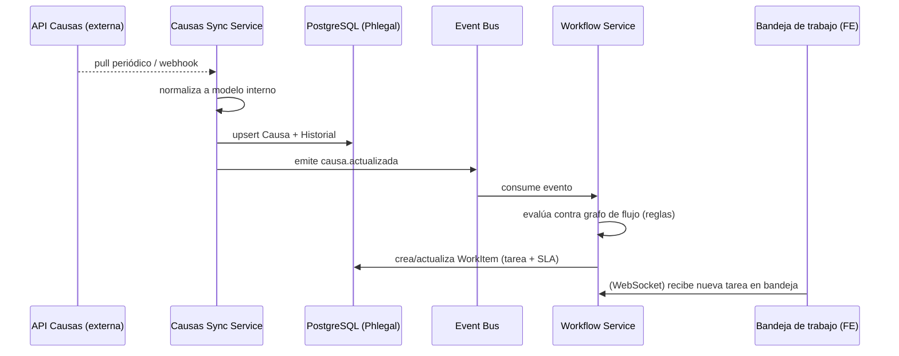

# Propuesta de arquitectura — Plataforma Phlegal 3.0
## Foco: módulo Abogado / Procurador (Bandeja de trabajo, Mis Causas, Acciones masivas)

**Fecha:** 2026-07-24 (actualizado 2026-07-24 tras spike de integración)
**Alcance:** re-arquitectura completa (frontend, BFF/API, modelo de datos, sistema de diseño), a partir del prototipo funcional actual en `src/app/`.

> **Nota de actualización:** entre la redacción original de este documento y esta revisión se ejecutó un **spike de integración** contra la API real de causas ("Oficina Virtual PJUD API") para validar los datos de "Mis Causas" y "Mi Escritorio". El diagnóstico de la sección 1 se corrigió para reflejar ese estado. Ver sección 10 para el detalle de qué se implementó y qué sigue pendiente del roadmap.

---

## 1. Diagnóstico del estado actual

El repo era, hasta el spike, un **prototipo de Figma Make** (`vite` + React 18) pensado para validar UX, no para producción. Estado actual:

| Observación | Evidencia | Riesgo |
|---|---|---|
| Todo el dominio vivía en el frontend | `WORK_ITEMS`, `HISTORIAL_STORE`, `TASKS`, `CASES` siguen como arrays hardcodeados en `ProcuradorView.tsx` (3000+ líneas) y `App.tsx` (1181 líneas). `CAUSAS_DETALLE` ya no alimenta "Mis Causas" (ver spike), pero sigue viva para "Mi Escritorio"/bandeja | Bandeja de trabajo, documentos y acciones masivas siguen sin backend real; "Mis Causas" y los KPIs de "Mi Escritorio" ya no |
| ~~No existe capa de API~~ **Ya existe un cliente HTTP real** | `src/lib/api.ts` consume la API PJUD real (`login`, `refresh`, `fetchListadoCausas`, `fetchCausaDetalle`, `fetchProcuradores`, `fetchHome`) desde **el navegador directamente**, sin BFF intermedio | Es un antipatrón respecto a la sección 4 de este documento ("no proxy directo"): el JWT de sesión vive en `localStorage`, y el browser llama a un sistema externo sin capa de auditoría/caché propia. Se corrige con el BFF Procurador (sección 10) |
| Tipos duplicados e inconsistentes | `CaseRow` (Procurador) vs `JCase` (App) vs `CASE_PROFIT` (Mandante) modelan la misma "causa" con campos distintos (`cuantia` vs `claimAmount`, `estado` vs `slaStatus`); ahora se suma un tercer shape real, `CausaListadoItem`/`CausaWeb` (`src/lib/api.ts`), que es la fuente de verdad para "Mis Causas" | Alto costo de mantenimiento, bugs de sincronización. El BFF debe ser el punto único de normalización (`@phlegal/domain-types`) |
| ~~Doble librería de componentes~~ **MUI es dependencia muerta** | `@mui/material`/`@emotion` siguen en `package.json`, pero un grep de todo `src/` confirma **cero imports reales** — no hay dos sistemas de diseño conviviendo en el código, solo una dependencia sin usar | Bajo — es solo peso de bundle/instalación. Basta con quitarla de `package.json`, no requiere migración |
| Lógica de negocio mezclada con presentación | El grafo de estados en `flujoCobranza.ts` es la única pieza "de dominio" bien separada; el resto (SLA, cálculo de plazos, reglas de acción) está inline en componentes | Reglas legales (plazos CPC, excepciones) no reusables ni testeables aisladas |
| "Bandeja de trabajo" ya modela bien el problema real | `WorkItem` (acción pendiente + plazo + SLA) separado de `CaseRow`/`CausaDetalle` (causa completa) es el patrón correcto: **tarea ≠ causa** | Buena base conceptual a preservar en el rediseño |
| Tres roles/vistas ya diferenciados | `ProcuradorView` (bandeja+causas+docs+métricas), `MandanteView` (BI/cliente), `AccionesMasivas` (bulk + generación de documentos) | Confirma que el sistema es multi-rol desde el día 1 |

**Conclusión:** el spike ya prueba que el modelo de datos de la API de causas real es consumible y calza razonablemente con la UX existente ("Mis Causas", "Mi Escritorio"). El riesgo ya no es "¿se puede integrar?" sino "¿dónde vive esa integración?" — hoy vive mal ubicada (en el browser). El trabajo inmediato de re-arquitectura es mover esa integración detrás de un BFF Procurador (sección 10), preservando el resto del diagnóstico original (modularización, design system, persistencia) como roadmap.

---

## 2. Principios de la arquitectura propuesta

1. **La causa no vive en Phlegal.** Es un dato de lectura desde una API externa (el sistema que ya trackea causas judiciales — PJUD/CRM del estudio). Phlegal no debe convertirse en el sistema de registro (*source of truth*) de la causa, solo de la **gestión y las tareas** sobre ella.
2. **Bandeja de trabajo como entidad de primera clase.** Las `Tareas`/`WorkItems` (con SLA, tipo de acción, asignación) son datos propios de Phlegal, generados a partir del estado de la causa + reglas de negocio (el grafo de `flujoCobranza.ts` es el germen correcto de esto).
3. **Un BFF por experiencia de rol**, no un monolito de API genérica: procurador/abogado necesita datos muy distintos a mandante (BI agregado) o admin.
4. **Frontend modular por dominio**, no por tipo de componente.
5. **Sistema de diseño único**, basado en un solo primitivo (Radix + Tailwind, tal como ya está en `components/ui/*`) — eliminar MUI.

---

## 3. Arquitectura de alto nivel

```mermaid
flowchart LR
    subgraph Frontend["Frontend (SPA modular)"]
        FE1[App Shell + Auth]
        FE2[Módulo Procurador\nBandeja / Mis Causas / Acciones masivas]
        FE3[Módulo Mandante\nBI / Reportes]
        FE4[Design System\n@phlegal/ui]
    end

    subgraph BFF["Capa BFF (Node/NestJS, por experiencia)"]
        BFF1[BFF Procurador]
        BFF2[BFF Mandante]
    end

    subgraph Services["Servicios de dominio (Phlegal Core)"]
        S1[Workflow Service\n(bandeja, SLA, reglas de acción)]
        S2[Documentos Service\n(generación, visación, firma)]
        S3[Acciones Masivas Service\n(orquestación batch)]
        S4[Notificaciones Service]
        S5[Auth/RBAC Service]
    end

    subgraph Integration["Capa de integración"]
        I1[Causas Sync/Adapter\n(cache + eventos)]
        I2[Cola de eventos\n(Kafka/SQS)]
    end

    subgraph External["Sistemas externos"]
        E1[(API de Causas\ndel estudio / PJUD)]
        E2[(Firma electrónica)]
        E3[(Storage documental S3)]
    end

    subgraph Data["Persistencia"]
        D1[(PostgreSQL\nPhlegal Core)]
        D2[(Redis\ncache/sesión)]
        D3[(OpenSearch\nbúsqueda causas/tareas)]
    end

    FE2 --> BFF1
    FE3 --> BFF2
    BFF1 --> S1 & S2 & S3 & S4
    BFF2 --> S1
    S1 --> D1
    S1 --> I1
    S2 --> E2 & E3
    I1 --> E1
    I1 --> I2 --> S1 & S4
    S1 --> D2
    S1 --> D3
    S5 --> BFF1 & BFF2
```

### Por qué BFF (y no un API único genérico)

- **Procurador** necesita respuestas optimizadas para la bandeja (agregaciones de SLA, conteos por tipo de acción, causas propias) — payloads chicos, muy frecuentes (polling/websocket).
- **Mandante** necesita BI agregado, cohortes, comparativos entre estudios — payloads grandes, poco frecuentes, cacheables.
- Cada BFF traduce los modelos de dominio de los servicios core al contrato exacto que su frontend consume, evitando el problema actual de `CaseRow`/`JCase`/`CASE_PROFIT` divergentes: **el contrato del BFF es la única fuente de verdad del shape para ese frontend.**
- Los servicios de dominio (Workflow, Documentos, Acciones Masivas) quedan libres de lógica de presentación y son reusables entre BFFs.

### Stack recomendado

| Capa | Tecnología | Justificación |
|---|---|---|
| Frontend | **React 18 + Vite + TypeScript** (mantener) | Ya validado, buena DX, el prototipo es reusable como punto de partida |
| Routing | **React Router 7** (ya está en `package.json`, no se usa aún) | Ya es dependencia; falta implementarlo — hoy `App.tsx` hace switch manual de vistas con `useState` |
| Server state | **TanStack Query (React Query)** | Reemplaza los `useState`/`useEffect` manuales de datos mock; da cache, invalidación, polling para la bandeja en tiempo casi-real |
| Estado de UI local | **Zustand** (liviano) | Para selección múltiple, filtros, wizard de acciones masivas — evita prop-drilling que ya se ve en `AccionesMasivas.tsx` |
| Formularios | **react-hook-form + zod** (react-hook-form ya está) | Validación de acciones/documentos tipada, compartible con el contrato del BFF |
| UI primitives | **Radix UI + Tailwind + CVA** (ya está en `components/ui/*`) | **Eliminar `@mui/material`/`@emotion`** — mantener un solo sistema reduce bundle y fragmentación visual |
| Tiempo real | **WebSocket / SSE** desde BFF Procurador | Bandeja de trabajo debe reflejar cambios de SLA/nuevas tareas sin refresh manual |
| BFF/API | **Node.js + NestJS (TypeScript)** | Comparte tipos con el frontend (monorepo), buen soporte de módulos/DI para separar BFF de servicios core |
| Comunicación interna | **REST/JSON** BFF↔cliente, **gRPC o REST interno** BFF↔servicios core | REST es suficiente al inicio; gRPC si el volumen de acciones masivas crece |
| Mensajería/eventos | **Kafka o AWS SQS/EventBridge** | Para reaccionar a cambios de causa desde la API externa sin polling constante en cada servicio |
| Base de datos | **PostgreSQL** | Relacional, encaja con el modelo de datos (causas, tareas, documentos, historial); soporta JSONB para campos variables (subestadoCRM libre, etc.) |
| Cache | **Redis** | Cache de causas leídas de la API externa, sesiones, rate-limit |
| Búsqueda | **OpenSearch/Elasticsearch** | Búsqueda de causas por rol/deudor/RUT con miles de registros (hoy `CAUSAS_DETALLE` ya simula 500+ causas) |
| Storage documental | **S3 (o equivalente)** | PDFs de escritos, mandatos, pagarés — hoy están como archivos estáticos en `public/docs/` |
| Auth | **OAuth2/OIDC (Auth0, Cognito o Keycloak) + RBAC** | Multi-rol ya existe conceptualmente (`Login.tsx` con `PROFILES`/`ProfileId`) — falta backend real de auth |
| Observabilidad | **OpenTelemetry + Grafana/Datadog** | Crítico dado que hay SLAs legales — necesitas trazabilidad de por qué una tarea se atrasó |
| Infra | **Contenedores (Docker) + Kubernetes o ECS**, IaC con Terraform | Estándar para escalar servicios independientes |
| CI/CD | Mantener **GitHub Actions** (ya usado para deploy) | Extender a pipelines por servicio |

**Monorepo recomendado:** Turborepo o Nx, con paquetes:
```
apps/
  web-procurador/      (o un solo web con lazy-loaded módulos por rol)
  web-mandante/
  bff-procurador/
  bff-mandante/
services/
  workflow-service/
  documentos-service/
  acciones-masivas-service/
  causas-sync-service/
packages/
  @phlegal/ui           (design system)
  @phlegal/domain-types (tipos compartidos: Causa, Tarea, etc.)
  @phlegal/flujo-cobranza (el grafo de flujoCobranza.ts, ya reusable)
```

---

## 4. Integración con la API de causas (requisito clave)

El requisito "la plataforma leerá datos de las causas desde una API" define el patrón de integración: **Phlegal no es dueño de la causa, es consumidor.**

### Patrón: Adapter + caché local + eventos, no proxy directo

1. **Causas Sync Service** consulta la API externa de causas (probablemente el sistema PJUD/CRM del estudio) mediante:
   - **Pull periódico** (polling/cron) para causas activas asignadas al estudio, o
   - **Webhook/push** si la API externa lo soporta, o
   - Ideal: **ambos** — pull inicial + webhook incremental.
2. Normaliza el payload externo al **modelo de dominio interno** (`Causa`, `TramiteHistorial`, `Litigante`, `Exhorto` — ver sección 5), aislando a todo el resto del sistema de los cambios/inconsistencias del formato externo (hoy el prototipo ya muestra ese problema: `estadoCRM`/`subestadoCRM`/`etapa` son texto libre inconsistente, resuelto parcialmente por el mapeo de alias en `flujoCobranza.ts`).
3. Persiste una **copia local (read replica funcional)** en PostgreSQL — no se re-consulta la API externa en cada request de la bandeja: eso sería lento y frágil ante caídas del proveedor.
4. Cada actualización de causa dispara un **evento** (`causa.actualizada`) a la cola → el **Workflow Service** reevalúa el estado vs. el grafo de flujo (`flujoCobranza.ts` generalizado a motor de reglas) y genera/actualiza `WorkItems` en la bandeja automáticamente.
5. Las **acciones que el abogado/procurador ejecuta en Phlegal** (ej. "marcar entregado", "responder consulta") se escriben primero en Phlegal (auditable, con SLA propio) y, si corresponde, se **notifican de vuelta** al sistema externo o generan el escrito para presentación judicial — Phlegal no escribe directamente en el sistema de causas salvo que la API externa lo permita explícitamente.



Esto también resuelve el problema de robustez: si la API externa cae, la bandeja sigue funcionando con la última copia sincronizada (con un indicador de "última sincronización hace X min").

---

## 5. Modelo de datos

Basado en las entidades que el prototipo ya modela implícitamente (`WorkItem`, `CausaDetalle`, `TramiteRow`, `Litigante`, `ExhortoRow`, `HistItem`, `DocItem`, `Task`) más lo necesario para multiusuario/multi-rol real.

```mermaid
erDiagram
    MANDANTE ||--o{ CAUSA : "encarga"
    ESTUDIO ||--o{ USUARIO : "emplea"
    ESTUDIO ||--o{ CAUSA : "gestiona"
    USUARIO ||--o{ CAUSA : "abogado_patrocinante"
    USUARIO ||--o{ CAUSA : "procurador_asignado"
    CAUSA ||--o{ TRAMITE_HISTORIAL : "tiene"
    CAUSA ||--o{ LITIGANTE : "involucra"
    CAUSA ||--o{ EXHORTO : "genera"
    CAUSA ||--o{ WORK_ITEM : "origina"
    CAUSA ||--o{ DOCUMENTO : "adjunta"
    CAUSA ||--o{ EVENTO_SEGUIMIENTO : "registra"
    CAUSA }o--|| ETAPA_FLUJO : "está_en"
    ETAPA_FLUJO ||--o{ TRANSICION_FLUJO : "permite"
    WORK_ITEM }o--|| TIPO_ACCION : "es_de_tipo"
    WORK_ITEM ||--o{ SLA_EVENTO : "trackea"
    WORK_ITEM }o--o| USUARIO : "asignado_a"
    DOCUMENTO }o--|| PLANTILLA_DOCUMENTO : "generado_desde"
    DOCUMENTO ||--o{ VISACION : "requiere"
    ACCION_MASIVA ||--o{ WORK_ITEM : "aplica_sobre"

    MANDANTE {
        uuid id PK
        string nombre
        string rut
        string codigo_corto "SNC, ITAU, TSF..."
    }

    ESTUDIO {
        uuid id PK
        string nombre
        string rut
    }

    USUARIO {
        uuid id PK
        string nombre
        string email
        enum rol "abogado, procurador, jefatura, mandante, admin"
        uuid estudio_id FK
    }

    CAUSA {
        uuid id PK
        string rol "C-7199-2026"
        uuid mandante_id FK
        uuid estudio_id FK
        uuid abogado_patrocinante_id FK
        uuid procurador_id FK
        string tribunal
        string procedimiento
        decimal cuantia
        boolean exhorto
        string tribunal_exhortado
        enum estado_causa "ACTIVO, INACTIVADO"
        enum semaforo "VERDE, AMARILLO, ROJO"
        string etapa_actual_id FK
        string estado_crm_externo "texto libre del origen"
        string subestado_crm_externo
        date fecha_ingreso
        enum estado_administrativo "sin_archivar, archivada"
        enum ubicacion "digital, fisica"
        string causa_origen_rol "para exhortos"
        string fuente_externa_id "id en la API de causas"
        timestamp ultima_sincronizacion
    }

    ETAPA_FLUJO {
        string id PK "despachese_mandamiento, notificada..."
        string label
        enum grupo "ingreso, notificacion, judicial, apremio, embargo_remate, cierre"
        boolean es_terminal
    }

    TRANSICION_FLUJO {
        string id PK
        string etapa_origen_id FK
        string etapa_destino_id FK
        string accion
        string condicion
    }

    TRAMITE_HISTORIAL {
        uuid id PK
        uuid causa_id FK
        int folio
        date fecha
        string etapa
        enum tipo_tramite "resolucion, escrito, actuacion_receptor"
        string descripcion
        string pdf_url
    }

    LITIGANTE {
        uuid id PK
        uuid causa_id FK
        string nombre
        string rut
        string calidad "DTE, DDO, AB.DTE, AP.DTE"
        enum tipo "natural, juridica"
    }

    EXHORTO {
        uuid id PK
        uuid causa_origen_id FK
        uuid causa_exhorto_id FK
        date fecha_ingreso
        string tribunal
        string estado
    }

    TIPO_ACCION {
        string id PK "apercibimiento, despachese, designacion_martillero..."
        string label
        string action_label
    }

    WORK_ITEM {
        uuid id PK
        uuid causa_id FK
        string tipo_accion_id FK
        uuid asignado_a_id FK
        enum estado_sla "estandar, limite, fuera"
        timestamp fecha_solicitud
        timestamp plazo_legal
        boolean plazo_urgente
        string autor "si viene de jefatura/consulta"
        text detalle
        enum estado "pendiente, en_progreso, bloqueada, completada"
        timestamp completada_en
    }

    SLA_EVENTO {
        uuid id PK
        uuid work_item_id FK
        timestamp calculado_en
        enum estado_sla
    }

    DOCUMENTO {
        uuid id PK
        uuid causa_id FK
        uuid plantilla_id FK
        enum estado "pendiente, visacion, visado, presentado"
        string storage_url
        uuid generado_por_id FK
        timestamp fecha
    }

    PLANTILLA_DOCUMENTO {
        uuid id PK
        string tipo
        string version
    }

    VISACION {
        uuid id PK
        uuid documento_id FK
        uuid revisor_id FK
        enum resultado "aprobado, rechazado, pendiente"
        text comentario
        timestamp fecha
    }

    EVENTO_SEGUIMIENTO {
        uuid id PK
        uuid causa_id FK
        uuid autor_id FK
        timestamp fecha
        enum tipo "estado, tarea, documento, tribunal, jefatura, contacto, observacion"
        enum canal "telefono, whatsapp, mail, presencial"
        text texto
    }

    ACCION_MASIVA {
        uuid id PK
        uuid ejecutado_por_id FK
        string tipo_accion_id FK
        int total_causas
        enum estado "en_progreso, completada, con_errores"
        timestamp fecha
    }
```



**Notas de diseño del modelo:**

- `CAUSA.estado_crm_externo` / `subestado_crm_externo` se preservan como texto libre (igual que hoy) porque la fuente externa no garantiza un enum estable — pero `etapa_actual_id` normaliza contra `ETAPA_FLUJO`, exactamente el rol que hoy cumple `ALIAS_A_NODO` en `flujoCobranza.ts`. Esa tabla de alias **debe pasar a ser configuración editable** (tabla `alias_etapa_externa`), no código, porque el estudio la va a necesitar ajustar sin deploy cuando la fuente externa cambie su texto.
- `WORK_ITEM` es independiente de `CAUSA` a propósito: una causa puede no tener tareas pendientes (estado "Gestionada"), y una tarea puede generarse por reglas del flujo o manualmente (consulta de jefatura).
- `SLA_EVENTO` guarda histórico del cálculo de SLA (no solo el estado actual) para reportabilidad — hoy el cálculo es puramente derivado en el cliente (`estadoDesdePlazoLegal`), lo que impide auditar "cuándo pasó de límite a crítico".
- `ACCION_MASIVA` referencia `WORK_ITEM`s afectados vía tabla puente (`accion_masiva_work_item`), permitiendo trazar qué acción masiva generó/cerró qué tareas — clave para el flujo visto en `AccionesMasivas.tsx`.

---

## 6. Estructura del módulo Abogado/Procurador (frontend)

Reorganizar `ProcuradorView.tsx` (3065 líneas, monolítico) en módulos por feature:

```
src/features/procurador/
  bandeja/
    BandejaDeTrabajo.tsx          # lista de WorkItems, agrupado por tipo/SLA
    hooks/useWorkItems.ts         # React Query: fetch + polling/websocket
    components/WorkItemCard.tsx
    components/FiltroSLA.tsx
  causas/
    MisCausas.tsx                 # listado (virtualizado, 500+ filas)
    CausaDetalle.tsx
    components/HistorialTramites.tsx
    components/PanelLitigantes.tsx
    components/PanelExhortos.tsx
    hooks/useCausa.ts
    hooks/useCausas.ts
  acciones-masivas/
    AccionesMasivas.tsx
    components/ArbolDecision.tsx
    components/GeneracionDocumentos.tsx
    hooks/useAccionMasiva.ts
  documentos/
    MisDocumentos.tsx
    hooks/useDocumentos.ts
  metricas/
    MisMetricas.tsx
  shared/
    types.ts                      # importa de @phlegal/domain-types
```

- **Virtualización obligatoria** en `MisCausas` (`@tanstack/react-virtual`): hoy se generan 498 causas sintéticas en el cliente (`generarCausasRomina`) — con datos reales de un estudio esto puede ser miles de filas; renderizar todo el DOM no escala.
- **Code-splitting por módulo** vía `React.lazy` + rutas de React Router — hoy todo se importa eager en `App.tsx`.
- El grafo de `flujoCobranza.ts` se traslada a `@phlegal/flujo-cobranza`, y **el motor que hoy corre en el cliente (`analizarCausaSegunFlujo`) se reubica también en el Workflow Service** — el frontend solo debe *mostrar* la sugerencia, no calcularla, para que sea consistente entre bandeja, detalle de causa y generación automática de `WorkItems`.

---

## 7. Sistema de diseño

### Decisión base: consolidar en **Radix UI + Tailwind CSS v4 + CVA**, eliminar MUI

Ya existe una implementación shadcn-style completa en `src/app/components/ui/` (accordion, dialog, table, tabs, sidebar, etc. — 40+ componentes). Es la base correcta. `@mui/material`/`@emotion` deben eliminarse: hoy conviven ambos sistemas sin necesidad, duplicando bundle y estilos.

### Estructura propuesta: `@phlegal/ui` (paquete independiente en el monorepo)

```
packages/ui/
  tokens/
    colors.ts        # semáforo SLA, estados, marca
    spacing.ts
    typography.ts
    motion.ts         # ya usan `motion/react` (framer-motion) — estandarizar duraciones/easings
  primitives/         # wrap de Radix (lo que hoy es components/ui/*)
  patterns/           # compuestos de dominio reusables entre módulos:
    SLABadge.tsx       # hoy reimplementado ad-hoc como ESTADO_META en cada archivo
    SemaforoDot.tsx
    CuantiaDisplay.tsx # formato CLP consistente (hoy hay formato inline repetido)
    RolCausaLink.tsx
  theme/
    light.css
    dark.css           # next-themes ya está de dependencia, no se usa aún
```

### Tokens clave a formalizar (ya existen como valores repetidos en el código, faltan centralizar)

| Token | Uso actual disperso | Valor sugerido |
|---|---|---|
| `--sla-estandar` | `bg-emerald-50 text-emerald-700 border-emerald-200` repetido en `ESTADO_META` | Token semántico único, no clases Tailwind hardcodeadas por componente |
| `--sla-limite` | `bg-amber-*` | idem |
| `--sla-fuera` | `bg-red-*` | idem |
| `--semaforo-verde/amarillo/rojo` | duplicado del SLA pero para `CausaDetalle.semaforo` — **unificar ambos conceptos en un solo token de "estado de riesgo"** si son semánticamente el mismo semáforo (evidencia: `SEMAFORO_POR_ESTADO` ya los mapea 1:1) |
| Paleta "consola de operaciones" de `AccionesMasivas.tsx` (`C.bg`, `C.panel`, `C.gold`...) | objeto de color inline solo en ese archivo | Si ese modo oscuro tipo "consola" es intencional para el flujo de acciones masivas, formalizarlo como **tema alternativo** del design system, no un objeto de constantes aislado |

### Principios del sistema de diseño

1. **Un componente, un lugar.** Nada de reimplementar badges de estado por vista (hoy `ESTADO_META` vive solo en `ProcuradorView.tsx` y `App.tsx` tiene su propio `SemColor`/`Priority` con otra paleta).
2. **Accesibilidad por defecto**: Radix ya da esto gratis (foco, ARIA, teclado) — mantenerlo es la razón principal para no volver a MUI.
3. **Modo claro/oscuro real** vía `next-themes` (dependencia ya instalada, sin usar) en vez de paletas hardcodeadas por archivo.
4. **Documentar en Storybook** (o Ladle, más liviano) cada patrón de dominio (`SLABadge`, `WorkItemCard`) para que Mandante y Procurador reusen los mismos átomos visuales aunque sus pantallas sean distintas.
5. **Iconografía**: mantener `lucide-react` (ya consistente en todo el proyecto, buena señal).

---

## 8. Roadmap de migración sugerido

No es razonable reescribir todo de una vez — el prototipo tiene valor de UX validado. Migración incremental:

**Fase 0 — Fundaciones (2-3 semanas)**
- Monorepo (Turborepo/Nx), extraer `@phlegal/ui` y `@phlegal/domain-types` del código actual.
- Eliminar MUI, dejar solo Radix/Tailwind.
- Definir contratos OpenAPI/tRPC del BFF Procurador basados en los tipos que **ya existen** en `ProcuradorView.tsx` (son un buen punto de partida, solo requieren consolidarse en un solo modelo).

**Fase 1 — Backend mínimo + integración de causas (4-6 semanas)**
- Causas Sync Service contra la API de causas real (empezar con pull periódico simple).
- PostgreSQL con el modelo de la sección 5 (sin todas las tablas de golpe: `CAUSA`, `TRAMITE_HISTORIAL`, `LITIGANTE`, `WORK_ITEM` primero).
- BFF Procurador sirviendo `GET /bandeja`, `GET /causas`, `GET /causas/:rol` con datos reales, reemplazando `WORK_ITEMS`/`CAUSAS_DETALLE` mock.
- Frontend: reemplazar arrays mock por React Query contra el BFF, mantener el resto de la UI intacta.

**Fase 2 — Workflow Service + tiempo real (3-4 semanas)**
- Mover el motor de `flujoCobranza.ts` al Workflow Service.
- WebSocket para bandeja en vivo.
- SLA histórico (`SLA_EVENTO`) en vez de cálculo puro en cliente.

**Fase 3 — Documentos y Acciones Masivas (4-5 semanas)**
- Documentos Service con storage real (S3) y visación (`VISACION`).
- Acciones Masivas Service para orquestar batch sobre `WORK_ITEM`s con auditoría.

**Fase 4 — Mandante/BI (paralelo, equipo separado posible)**
- BFF Mandante + agregaciones (cohortes, comparativo de estudios) — puede alimentarse de la misma base `CAUSA`/`WORK_ITEM` vía vistas materializadas o un data mart si el volumen lo justifica.

---

## 9. Riesgos y decisiones abiertas

- **Confirmar el contrato real de la API de causas** (¿REST? ¿SOAP/legacy del PJUD? ¿rate limits?) antes de diseñar el Sync Service en detalle — es el mayor desconocido y condiciona si el patrón es polling, webhook o ambos.
- **Definir si Phlegal puede escribir de vuelta** al sistema de causas (ej. marcar una gestión como realizada) o si toda "escritura judicial" sigue pasando por el tribunal/PJUD directamente y Phlegal solo gestiona el *trabajo interno* — esto cambia el diseño de `WORK_ITEM` vs. acciones que sí impactan la causa.
- **Volumetría esperada** (cuántas causas activas, cuántos estudios, cuántos usuarios concurrentes) para dimensionar si microservicios separados se justifican desde el día 1 o si conviene arrancar con un **monolito modular** (mismo código, módulos separados por dominio, un solo deploy) y extraer servicios cuando haya evidencia de necesidad — dado que el equipo parte de un prototipo, un monolito modular en NestJS es probablemente más pragmático que 5 servicios desde el inicio.

---

## 10. Estado de implementación — BFF Procurador (spike → primera versión real)

Esta sección documenta lo ya resuelto por el spike de integración y la primera versión del BFF Procurador construida a partir de él, priorizada como primer paso de código de la Fase 1 del roadmap (sección 8).

### Contrato de la API de causas (resuelve una de las decisiones abiertas de la sección 9)

Confirmado contra el ambiente de desarrollo: es **REST + OpenAPI 3** ("Oficina Virtual PJUD API", `GET /api/openapi.json`), no SOAP/legacy. Auth `HTTPBearer` (JWT de 1h + refresh token). Paginación `page`/`page_size` en los listados. No hay evidencia de webhooks — el patrón de integración debe ser **pull periódico** (polling), no push, al menos en esta fase.

Endpoints usados por el BFF Procurador:
- `POST /login`, `POST /refresh` — autenticación.
- `POST /web_listado_causas` — listado paginado y filtrable de causas (alimenta "Mis Causas").
- `GET /causa/{causa_id}` — detalle completo de una causa (historia, litigantes, exhortos).
- `GET /procuradores` — catálogo de procuradores del estudio (filtro de "Mis Causas").
- `GET /home` — agregados de semáforo de cartera (alimenta las cards de "Mi Escritorio").

### Decisión de diseño: BFF ligero, no NestJS/monorepo todavía

El roadmap (sección 8, Fase 0) propone Turborepo/Nx + NestJS. Se decidió **no** partir por ahí: el spike ya demostró que el contrato de datos funciona: lo urgente era sacar la sesión y las llamadas a la API externa del navegador, no montar el monorepo completo. Se implementó un **BFF mínimo (Express + TypeScript, un solo proceso)** en `server/`, con estas responsabilidades:

1. **Dueño de la sesión.** El BFF llama a `POST /login` de la API PJUD, y en vez de devolver el `access_token`/`refresh_token` al navegador, los guarda en una sesión server-side (cookie `httpOnly` + store en memoria) y solo entrega al frontend un `session_id` opaco. El navegador deja de ver o guardar el JWT del sistema externo.
2. **Refresh transparente.** El BFF renueva el `access_token` contra la API externa cuando expira, sin que el frontend lo sepa — el frontend solo ve `401`/`200` de sus propios endpoints.
3. **Proxy con forma propia**, no proxy 1:1: expone `GET /bff/causas`, `GET /bff/causas/:id`, `GET /bff/procuradores`, `GET /bff/home`, con el mismo shape de datos que ya usa `src/lib/api.ts` (para no tocar los componentes de React), pero es la capa donde a futuro se agregan cache/normalización sin volver a tocar el frontend.

Esto cumple el principio de la sección 4 ("no proxy directo") sin pagar el costo completo de Sync Service + Postgres + cola de eventos todavía — es un peldaño intermedio explícito entre "spike en el browser" y "Fase 1 completa" del roadmap.

### Pendiente para completar la Fase 1 real

- Persistencia (Postgres) de causas — hoy el BFF sigue siendo *pass-through* con cache en memoria de muy corto plazo, no una réplica funcional.
- Extracción a monorepo/NestJS cuando se sume el BFF Mandante.
- Reemplazar el store de sesión en memoria por Redis antes de correr más de una instancia del BFF.
